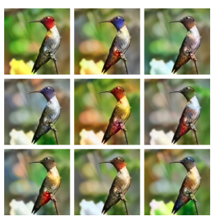
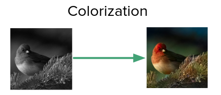
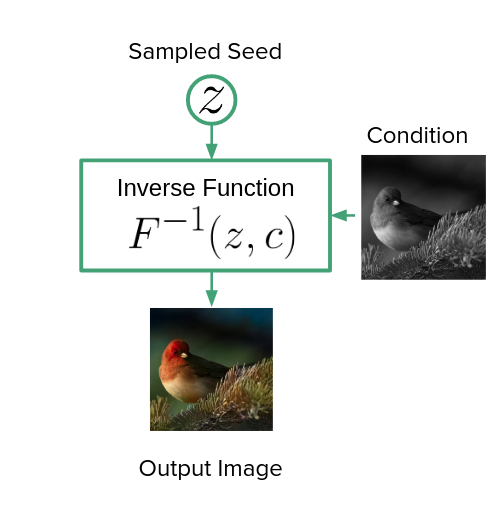
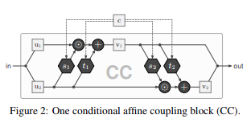
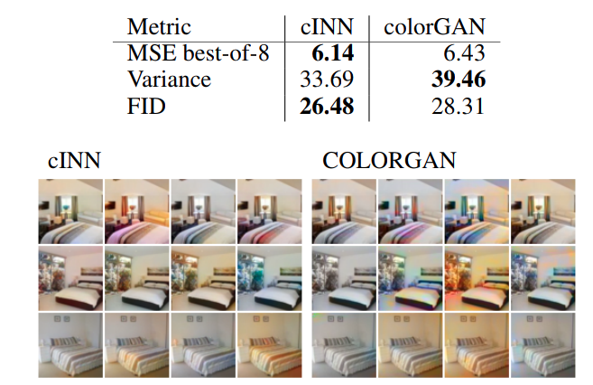
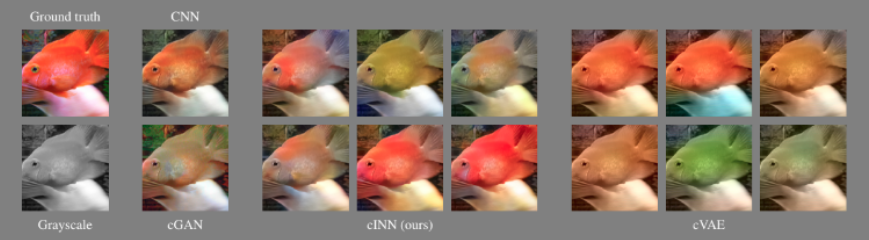
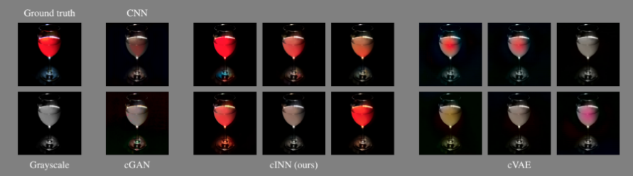
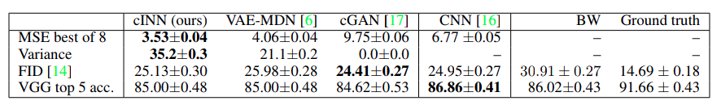
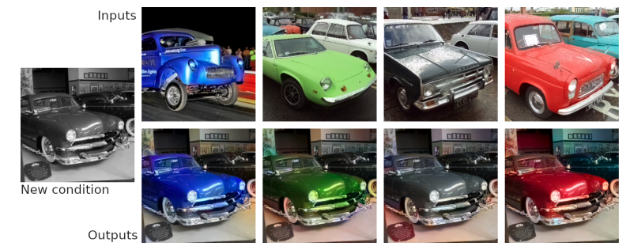

# &#30446;&#27425;

1.  [導入](#org29d4b64)
2.  [Invertible Neural Networks (Normalizing Flow, Flow-based Model) とは何か](#org48488f3)
3.  [Conditional INN](#org703eb29)
4.  [訓練](#org2a41f62)
5.  [結果](#orgead2165)
    1.  [少ない訓練時間と高い品質](#orgad91c16)
    2.  [多様性のある画像の生成](#org2cad714)
    3.  [別タスクへの応用](#org0ee3e7b)
6.  [読んだ感想とか](#org06da90e)

# 導入

Paper Introduction:  Image Generation  with Guided Conditional Invertible Neural Networks (CINN) [1] は Flow-based Model という生成モデルの一種を応用した、自動着彩を中心とした手法の論文です。ドイツの VLL-HD (Visual Learning Lab at Heidelberg University) が中心に研究・開発しています。  
実装は例によって PyTorch ですが、使っているライブラリ FrEIA が謎めいた実装をしているので、解読は困難です。  

  

[1]: [Guided Image Generation with Conditional Invertible Neural Networks](https://github.com/VLL-HD/conditional_invertible_neural_networks)  

cINN の入力は、グレースケールの画像と生成シードで、出力は入力に基づいたカラー画像 (正確には画像のカラー成分) になります。つまり生成シードを上手いこと調節することで任意の着彩が出来る、というのが強みになります。  

本研究で用いたデータセットは MNIST (手書き文字データセット) や LSUM bedroom (寝室の画像)、ImageNet (色々なラベルの大量の画像) とよく見るデータセットで、比較は Pix2Pix や cVAE といった有名な (悪く言えば latest SOTA ではない) 手法になっています。  

  

# Invertible Neural Networks (Normalizing Flow, Flow-based Model) とは何か

Invertible Neural Networks (INN) とはその名の通り、逆方向の演算が出来る Neural Network です。別称としては Normalizing Flow とか Flow-based Model とか色々ありますが、どれも概念的にはほぼ同じです。  

INN は次のような式を満たす **逆関数を持つ** 関数 \(f\) をモデル化することになります。但し \(x\) は画像や文のような実体で、 \(z\) は潜在表現というそれら実体の特徴をベクトル / 行列化したものになります。つまり INN は画像と潜在表現を直接結びつけるような関数 \(f\) のモデルになります。  

\begin{eqnarray}
z = f(x)
\end{eqnarray}

INN の目的関数は、 実際の画像 \(x\) に高い確率を与える(つまり \(x\) に近いデータを生成出来るようになる) ことになります。なので、次の式になります。 (最小化するために - 1 をかけています)  

\begin{eqnarray}
\mathcal{L} = - \log{p_X(x)}
\end{eqnarray}

この式では \(x\) をそのまま 確率空間にエイヤッとするのは無理なので、モデル \(f\) を経由して確率を与えようとしてあげます。  

\begin{eqnarray}
p_X(x) = p_Z(z = f(x))|J_f|
\end{eqnarray}

\(J\) はヤコビアンです。ヤコビアンって何？と思うかもしれませんが、高校で習った極座標変換の応用だと思って頂ければ大丈夫です。 (INN ではめちゃめちゃ重要ですが、この論文の理解には不要です。)  

# Conditional INN

Conditional INN は INN になんとか Conditional な情報を突っ込みたい、という需要を叶えるためのモデルです。具体的にはこんな感じです。  

  

ここで \(z\) を上手いこと調整することで、青い鳥だったり、金色の鳥だったりを生成できるようにする (近年の 1 to 1 な画像変換とはちょっと違いますね) のがこの cINN になります。  

もうちょっと詳しい話をすると、彼らは INN の Affine Coupling Layer という部品に注目して conditional Affine Coupling (CC) という手法を提案しました。 CC で行っていることは単純で、上手いこと前処理(NN のレイヤーを通すとか)した condition を既存の Affine Coupling の構造の \(s\) , \(t\) の各行列に concat しています。たったこれだけ。  
Affine Coupling は INN に複数回出現するので、それらを全て CC に置換すればモデルの完成です (本研究はこれ以外にも色々工夫をしていますし、寧ろそっちがかなり評価されていますが、そこは INN の話をする必要があるので割愛します)。  

  

# 訓練

cINN の目的関数は INN に conditional input を加えた次のものになっています。(正確にはこれにパラメータの正則化項など色々付いてきます。)  

\begin{eqnarray}
\mathcal{L} = - \log{p_X(x; c)} = - \log {p_Z(z = f(x; c))} - \log{|J_f|}
\end{eqnarray}

cINN も INN も式とモデルが定義できれば後は単純にデータを入れて目的関数を最適化するだけで学習が終わります。  

# 結果

幾つか種類があるので、視認しやすい結果のみ取り出して紹介します。  

## 少ない訓練時間と高い品質

この結果は LSUM bedroom という寝室の画像のデータセットを用いて訓練し、colorGAN という GANsと比較したものになります。  
MSE best of 8 とは生成された画像から8枚サンプリングを行って、教師データに一番近かったものの誤差になります。Varianceはサンプルした8枚の画像の分散で、FID は現実の画像との類似度を上手いこと測る仕組みです。  

また訓練時間についても彼らは評価しようとしており、 cINN が 1080 Ti GPU x 1 で 4 hours を一発であったのに対して、colorGAN は同じ条件で 24 hours 以上かかりしかも途中で学習が失敗するケースが多発した、と言っています。  

さらに Variance については、 colorGAN が明らかに不自然な着彩を行うケースを (上から 2 , 右から 2) 指摘しています。  

  

## 多様性のある画像の生成

また Pix2Pix や cVAE に比べて、cINN は多様かつ意味をある程度理解した (多分) 画像生成が出来ていることが確認できると思います。 また 多様な画像を生成しているのにもかかわらず、MSE best of 8 で勝っているのも注目できる点として挙げられます。  

  

  

  

## 別タスクへの応用

また cINN は潜在表現と画像が双方向につながっているので、別タスク、画像のスタイル変換も行うことが出来ます。  

  

# 読んだ感想とか

この記事のスライド版はこちら [10] になります (English Only)  

[10]: <https://docs.google.com/presentation/d/13ZmRUHPl-y2eptHz58kGcw2w5ZlQOdqhORnwIRJPIGg/edit?usp=sharing>  

