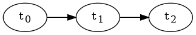
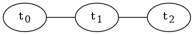
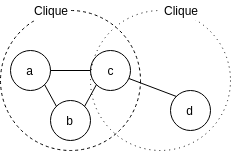
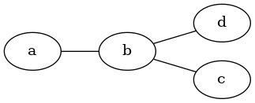

# 導入

> 因子グラフ(factor graph) 何もわからん  

DeepDiveの論文を徒然なるままに読んでいたところ、ふと factor graph という用語が出てきて、深層学習(書籍)で読んだなーと思っていたんですが、突如現れた Gibbs Sampling とかいうサンプリング手法を周辺化の手法として用いるというテクニックが出てきたところでわけがわからなくなりました。  

ということでまずは深層学習の factor graph を構造化確率モデル(structured probabilistic models) から復習していこうと思います。  

# 構造化確率モデル

構造化確率モデル(structured probabilistic models、graphical model、グラフィカルモデル)とは確率変数間の直接的な相互作用のみをモデル化できる枠組みを提供する、 **確率モデルの記述方法の一種** です。グラフィカルモデルという名前からわかように、このモデルの構造はグラフとして定義されています。これに対して非構造化確率モデルというものがありますが、比較的にメモリを食べ過ぎたり、統計的有効性を保証するのが難しかったり、推論やサンプリングにかかる実行時間が多くかかったりするのでこちらの方が好まれて使われるらしいです(実際に統計を取ったわけではないですが先述の通り多くの利点があります)。  

構造化モデルには以下の2種類が存在しています。今回触れるのはそのうちの後者、無向モデルです。  

-   有向グラフィカルモデル(信念ネットワーク、ベイジアンネットワーク、directed graphical model, belief network, Bayesian network)  
    
    

-   無向グラフィカルモデル(マルコフ確率場、マルコフネットワーク、undirected graphical model, Markov random fields, Markov network)  
    
    

# 無向グラフモデル

無向グラフモデルとは、無向グラフ \(\mathcal{G}\) で定義された構造化確率モデルです。  

このグラフモデルの非正規化確率分布(unnormalized probability distribution)は、以下の \(\tilde{p}(x)\) で表される。  

\begin{align*}
    \tilde{p} (\bm{x})  &= \Pi_{\mathcal{C}\in\mathcal{G}} \phi(\mathcal{C}) \\ 
    where\ \mathcal{C} \ & is \ clique\ in\ the\ graph \\
    \phi({\mathcal{C}}) & is \ factor,\ clique\ potential
\end{align*}

\(\mathcal{C}\) はグラフ内のクリークを示しており、クリークとは、グラフの辺によってすべてが互いに接続されているノードの部分集合です。  

\(\phi(\mathcal{C})\) は \(\mathcal{C}\) の因子 (factor) 、言い換えると  clique potential という値です。これは後述のために非負を取るように成約されます。  

  

つまり非正規化確率分布は、すべての \(\mathcal{C}\) の因子の積で表されるので、非負となります。これは理論的な解析を行う際に便利であることが知られているので、因子に非負制約がかかります。  

  

例として上の無向グラフを考えると、 \(\tilde{p}(\bm{x}) = \tilde{p}(a, b, c, d)= \phi_{a, b}(a, b) \phi_{b, c}(b, c) \phi_{b, d}(b, d)\) となります。  

ところで \(\tilde{p}(\bm{x})\)  は \(\forall \bm{x}\ \tilde{p}(\bm{x}) > 0 \because \forall \mathcal{C}\ \phi(\mathcal{C})> 0\) ですが、\(\int \tilde{p}(\bm{x}) d\bm{x} \neq 1\) \(\Sigma_{\bm{x}} \tilde{p}(\bm{x})  \neq 1\) であるので、正規化を施す。  

\begin{align*}
p(\bm{x}) &= \cfrac{1}{Z} \tilde{p}(\bm{x})\\
where \  Z &= \int \tilde{p}(\bm{x})d\bm{x} \\
Z &= \Sigma_{\bm{x}} \tilde{p}(\bm{x})
\end{align*}

このとき、\(Z\) を分配関数 (partition function) という。  

ただし、分配関数は \(\bm{x}\) について周辺化をしなければならないので計算コストがばりかかってしまいます。そのため、Gibbs Sampling などの **近似アルゴリズム** を用いる、というわけです。  

ちょっと話を戻しましょう。  

先程 \(\forall \mathcal{C}\ \phi(\mathcal{C}) > 0\) であることを **制約** として上げましたが、これをエネルギーベースモデル(energy-based model, EBM) を用いることでモデルの性質で制約を満たすことができます。  

エネルギーベースモデルの非正規化確率分布は、以下の式で表されます。  

\begin{align*}
\tilde{p}(\bm{x}) &= exp(- E(\bm{x})) \\
where\ E(\bm{x}) &is\ energy\ function\\
\tilde{p}(\bm{x}) &> 0\because \forall \bm{x} \ exp(\bm{x}) > 0
\end{align*}

これを用いることで制約なし最適化を行うことができます。  

逆に \(\phi(\mathcal{C})\) を直接学習使用すると、非負制約を守らないといけないので、ある特定の最小確率値を任意に課さなければなりません。つまりこちらでは制約付き最適化を行わなりませんので、当然こちらの方が学習難易度が高いです。  

ちなみに、EBM の \(\tilde{p}(\bm{x}) = exp (-E(\bm{x}))\) はボルツマン分布とも呼ばれます。おそらくここが深層学習とのつながりが最も察しやすいところでしょう。  

実際にエネルギーベースモデルを用いて、先程の非正規化確率分布を示すと、 \(E(\bm{x}) = E(a, b, c, d) = E_{a, b}(a, b) + E_{b, c}(b, c) + E_{b, d}(b, d)\) となる。  

  

ここで、 \(\phi\) 関数を対応する負のエネルギー指数関数にすると、  

 \begin{align*}
 \tilde{p}(\bm{x}) &= \Pi_{\mathcal{C}\in\mathcal{G}} \phi (\mathcal{C}) \\
&=\Pi_{\mathcal{C}\in\mathcal{G}}exp(-E(\mathcal{C})) > 0 \\
\because & \forall \bm{x} \ exp(\bm{x}) >0
\end{align*}

繰り返すようですが、これで制約なしの最適化ができます。やったでおい  

# ここまでの話

-   構造化確率モデルは非構造化確率モデルの計算コストを下げることができる。
-   無向グラフモデルは、マルコフ確率場、マルコフネットワークと呼ばれ、ノード間が無向のエッジで繋がれている。
-   無向グラフの確率分布は、 \(p(\bm{x}) = \cfrac{1}{Z} \tilde{p}(\bm{x}) = \cfrac{1}{Z}\Pi_{\mathcal{C}\in \mathcal{G}} \phi(\mathcal{C}) > 0\) で表される。
-   無向性グラフの確率分布の非負性は理論上便利なので、これを制約なしで使えるようにしたく、そのためにはエネルギーベースモデルを用いると嬉しくなれます。

